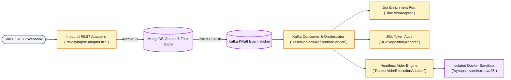

<!-- noinspection HtmlDeprecatedAttribute -->
<div align="center">

# Synapse

**Autonomous AI Engineering Platform Bridging Alerts to Self-Driving Code Modifications inside Isolated Docker Sandboxes**

[](https://github.com/celikfatih/synapse/actions/workflows/ci.yml)
[](#test-coverage--verification)
[](https://adoptium.net/)
[](https://spring.io/projects/spring-boot)
[](docs/ARCHITECTURE.md)
[](LICENSE)
[](CONTRIBUTING.md)
[](CODE_OF_CONDUCT.md)

[Overview](#why-synapse) • [Key Features](#key-features) • [Quickstart](#quickstart--5-minute-setup) • [Test Coverage](#test-coverage--verification) • [Architecture](#architecture--data-flow) • [Documentation](#documentation--governance) • [Contributing](CONTRIBUTING.md)

</div>

---

> **syn·apse** (/ˈsɪnæps/) *noun*: In a biological system, a synapse is the junction where a signal is transmitted from one nerve cell to another.  
> *In this project: the critical junction where a developer alert or conversation sparks an autonomous, verifiable action in your repository.*

---

## Why Synapse?

Modern engineering teams face a continuous flood of alerts from monitoring systems, bug trackers (Jira), user chat channels (Slack), and REST webhooks. Traditionally, resolving these alerts requires a developer to manually triage the ticket, clone the repository, locate relevant symbols, write boilerplate fixes, run verification tests, and open a Pull Request.

**Synapse** automates this entire lifecycle. It serves as an enterprise-grade **AI Control Plane & Workflow Orchestrator**:
1. **Ingests alerts asynchronously** from Slack webhooks/commands (`/api/slack/*` verified with HMAC-SHA256) or REST APIs (`/api/v1/tasks`).
2. **Decouples processing** via an atomic **Transactional Outbox & Apache Kafka** pipeline.
3. **Enriches context** by querying Jira ticket acceptance criteria.
4. **Provisions isolated Docker sandboxes** (`synapse-sandbox:java25`) with strict CPU/memory quotas.
5. **Clones & checks out feature branches** (`feat/TASK-123`) securely via token authentication (`SYNAPSE_GIT_TOKEN`).
6. **Delegates autonomous coding** to headless **[Aider](https://aider.chat/)** (`aider --yes --test-cmd "./gradlew test"`), allowing the AI to index repository AST maps, edit files, run tests, and auto-heal compiler failures offline.
7. **Commits, pushes & opens GitHub Pull Requests** (`CreatePullRequestPort` & `GitHubRestPullRequestAdapter`) automatically when tests pass, attaching the PR link (`Task.pullRequestUrl`) across MongoDB.
8. **Notifies teams on Slack** (`SendNotificationPort` / `SlackWebhookNotificationAdapter`) via Spring `RestClient` with Block Kit payloads when the Pull Request is ready for review or when diagnostic errors occur.

---

## Key Features

| Feature                                 | Description |
|:----------------------------------------| :--- |
| **Zero-Compromise Container Isolation** | AI coding agents execute inside non-root Docker sandboxes (`synapse-sandbox:java25`, UID 1000) with strict resource quotas (`8g` RAM, `4 CPUs`) and mounted dependency build caches. |
| **Strict Hexagonal Architecture**       | Clean separation of domain models, state transitions, and use cases (`dev.synapse.domain.*`) from external frameworks (Spring MVC, Kafka, MongoDB, JGit, Docker APIs). |
| **Transactional Outbox Pattern**        | Guaranteed at-least-once event delivery without two-phase commit overhead. Task state changes (`MongoDB`) and domain events are committed atomically before Kafka dispatch. |
| **Full Auditability & Tracing**         | End-to-end correlation (`correlationId`) powered by OpenTelemetry (`W3C Baggage`) and a decoupled `CorrelationIdRecordInterceptor` Anti-Corruption Layer, ensuring unbroken log traceability across REST, Slack, Kafka retries, and Docker sandboxes. |
| **Pre-Flight Repository Handshake**     | Performs a fast remote reference verification check (`GitRepositoryPort.validateRepositoryExists`) using `git ls-remote` before provisioning directories or containers, preventing resource waste on invalid URLs or expired tokens. |
| **AST Repo-Map & Self-Healing Tests**   | Integrates Aider's tree-sitter AST symbol indexer and `--test-cmd` verification loops. If a test fails after an edit, error outputs are automatically fed back to self-heal code. |
| **Dynamic Pull Request Target & PATs**  | Automatically discovers the repository's exact default branch (`GET /repos/{owner}/{repo}`) and opens verified pull requests (`GitHubRestPullRequestAdapter`) using Organization Classic PATs (with SSO) or Fine-grained PATs. |
| **Slack Ingestion & Deduplication**     | Outbound Block Kit notifications (`SendNotificationPort`) combined with intelligent inbound deduplication (`SlackPayloadTranslator` separating `app_mention` vs `message` channel events) and automatic webhook retry filtering (`X-Slack-Retry-Num`). |

---

## Quickstart & 5-Minute Setup

### Prerequisites
* **JDK 25+** (Eclipse Temurin recommended)
* **Docker & Docker Compose v2+**
* **Gradle 8+** (included via `./gradlew`)

### 1. Start Local Backing Services
Spin up local MongoDB (`localhost:27017`), Apache Kafka broker (`localhost:29092`), and Kafka UI (`http://localhost:8082`):
```bash
docker compose up -d
```

### 2. Configure Environment Credentials
Copy the reference `.env.example` file and configure your API keys, tokens, and Slack secrets (`SYNAPSE_JIRA_TOKEN`, `SYNAPSE_GIT_TOKEN`, `SYNAPSE_SLACK_WEBHOOK_URL`, `SYNAPSE_SLACK_SIGNING_SECRET`):
```bash
cp .env.example .env
```

### 3. Build the AI Sandbox Docker Image
Pre-build the headless Aider execution environment (`synapse-sandbox:java25`) used during task execution:
```bash
docker build -t synapse-sandbox:java25 -f Dockerfile.sandbox .
```

### 4. Verify & Run the Platform
Run the offline-friendly unit test suite (`AssertJ`, `Mockito`, `JUnit 5`) alongside **JaCoCo code coverage**, then launch the Spring Boot server:
```bash
# Run verification suite and generate JaCoCo code coverage report
./gradlew test jacocoTestReport

# Start Synapse application server on port 8080
./gradlew bootRun
```

---

## Test Coverage & Verification

Synapse enforces strict test verification across domain state transitions, workflow orchestration, and outbox serialization before shipping code. We use **JaCoCo** (`jacoco`) integrated directly into our Gradle build pipeline and CI/CD workflows.

### Running & Viewing Coverage Reports
To execute unit tests and generate interactive HTML coverage reports locally during development:
```bash
./gradlew test jacocoTestReport
```
Once the task completes, open `build/reports/jacoco/test/html/index.html` in your web browser to inspect line and branch coverage across all modified packages and classes.

---

## Submitting Your First Autonomous Task

Once Synapse is running on `http://localhost:8080`, you can submit tasks through multiple channels:

### Option A: Via REST API
```bash
curl -X POST http://localhost:8080/api/v1/tasks \
  -H "Content-Type: application/json" \
  -d '{
    "ticketKey": "PAY-1042",
    "repositoryUrl": "https://github.com/your-org/payment-service.git",
    "branch": "main",
    "prompt": "Fix null pointer exception in PaymentValidator when currency code is empty"
  }'
```

### Option B: Via Slack App (@Synapse Mentions & Slash Commands)

To connect Synapse to your Slack workspace, follow our step-by-step **[Slack Setup & Installation Guide](docs/SLACK_SETUP.md)**. 

#### Quick Setup Summary:
1. **Expose Local Server**: Use `ngrok http 8080` to generate a public HTTPS ingress endpoint during local development.
2. **Slack Dashboard Configuration** (`https://api.slack.com/apps`):
   * **Event Subscriptions**: Enable events and point Request URL to `https://<your-host>/api/slack/events` (subscribing to `app_mentions:read` and `message.channels`).
   * **Slash Commands**: Create `/synapse` (or `/tasks`) pointing Request URL to `https://<your-host>/api/slack/commands`.
   * **Incoming Webhooks**: Activate webhooks and copy the URL for `#synapse-alerts` completion notifications.
3. **Configure Environment Variables**:
   ```properties
   SYNAPSE_SLACK_SIGNING_SECRET=your_slack_app_signing_secret
   SYNAPSE_SLACK_WEBHOOK_URL=https://hooks.slack.com/services/T000/B000/XXX
   ```

Once installed, you can submit tasks right from any Slack channel:
* **App Mention / Event (`/api/slack/events`)**: Tag `@synapse fix null pointer exception in PaymentValidator` inside a channel or thread.
* **Slash Command (`/api/slack/commands`)**: Type `/synapse submit PAY-1042 https://github.com/your-org/payment-service.git main Fix NPE in PaymentValidator`.

All requests pass through `SlackSignatureVerificationFilter` (`X-Slack-Signature` HMAC-SHA256 check). Upon validation, Synapse immediately returns an `ACCEPTED` task receipt (`"Task submitted to Synapse! 🚀"`). Synapse's background outbox scheduler (`PendingEventPublishJob`) dispatches the event to Kafka (`tasks` topic), where `TaskWorkflowApplicationService` enriches, provisions, clones, fixes the code autonomously, opens a GitHub PR, and sends a structured Block Kit notification back to Slack (`SendNotificationPort`)!

---

## Architecture & Data Flow

Synapse decouples high-throughput webhooks from resource-intensive container builds using an asynchronous, event-driven topology:



**Want deep technical diagrams, state transition rules (`TaskStatus`), or Architectural Decision Records (ADRs)?**  
See our comprehensive technical reference: **[`docs/ARCHITECTURE.md`](docs/ARCHITECTURE.md)**.

---

## Documentation & Governance

Synapse adheres to industry-standard open-source governance practices, emphasizing rigorous engineering quality, transparent architectural decisions, and an inclusive, secure community model.

### Technical & Operational Documentation

| Guide | Scope & Key Contents |
|:---|:---|
| **[Architecture Reference (`docs/ARCHITECTURE.md`)](docs/ARCHITECTURE.md)** | Deep-dive C4 and Mermaid system diagrams, Hexagonal Architecture boundaries (`dev.synapse.domain.*`), outbox/Kafka choreography, AST symbol indexing, and complete Architectural Decision Records (ADR-1 through ADR-9). |
| **[Operational Workflows (`docs/WORKFLOWS.md`)](docs/WORKFLOWS.md)** | Comprehensive sequence and state diagrams for all 5 core platform lifecycles: autonomous task execution, pre-flight remote repository checks, Slack event deduplication, dead-letter recovery (`DLQ`), and offline TDD verification. |
| **[Slack Setup Guide (`docs/SLACK_SETUP.md`)](docs/SLACK_SETUP.md)** | Step-by-step instructions for configuring Slack App event subscriptions (`app_mention`, `message.im`), slash commands (`/synapse`), Block Kit webhooks, ngrok ingress tunnels, and built-in retry filtering (`X-Slack-Retry-Num`). |
| **[Spring Boot & Build Guide (`HELP.md`)](HELP.md)** | Reference guides and official documentation links for Spring Boot 4.1, Gradle 9 configuration cache, OpenFeign adapters, and containerized OCI image builds. |

### Community & Governance Policies

| Policy | Methodology & Standards |
|:---|:---|
| **[Contributing Guide (`CONTRIBUTING.md`)](CONTRIBUTING.md)** | **Development Methodology**: Outlines local development setup, strict Hexagonal separation rules, Test-Driven Development (TDD) enforcement (`80%+ JaCoCo branch/line coverage`), conventional commit formatting, and pull request verification checklists. |
| **[Security Policy (`SECURITY.md`)](SECURITY.md)** | **Vulnerability Management**: Details our private vulnerability disclosure timeline and embargo practices, Docker non-root sandbox (`UID 1000`) isolation guarantees, and supported version matrix. Report security concerns confidentially to **[`celikfatih@protonmail.com`](mailto:celikfatih@protonmail.com)**. |
| **[Code of Conduct (`CODE_OF_CONDUCT.md`)](CODE_OF_CONDUCT.md)** | **Community Standards**: Adopts the **Contributor Covenant v2.1** to ensure a safe, collaborative, and professional engineering environment free of harassment across all repository issues, pull requests, and community channels. |
| **[License (`LICENSE`)](LICENSE)** | **Open-Source Licensing**: Synapse is licensed under the **Apache License 2.0**, granting open use, modification, and redistribution rights backed by an explicit contributor patent grant. |

---

<!-- noinspection HtmlDeprecatedAttribute -->
<div align="center">
  Built with ❤️ for resilient, verifiable AI engineering.
</div>