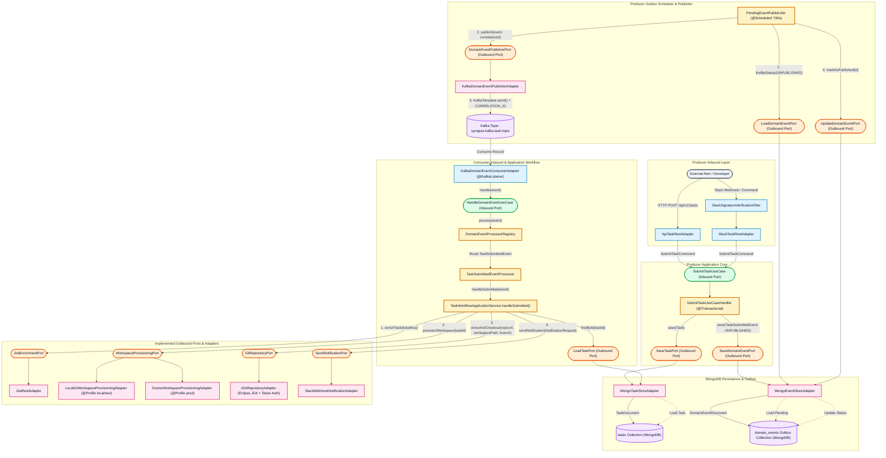
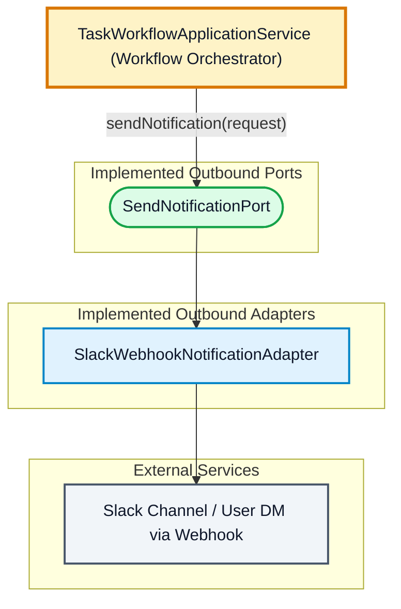
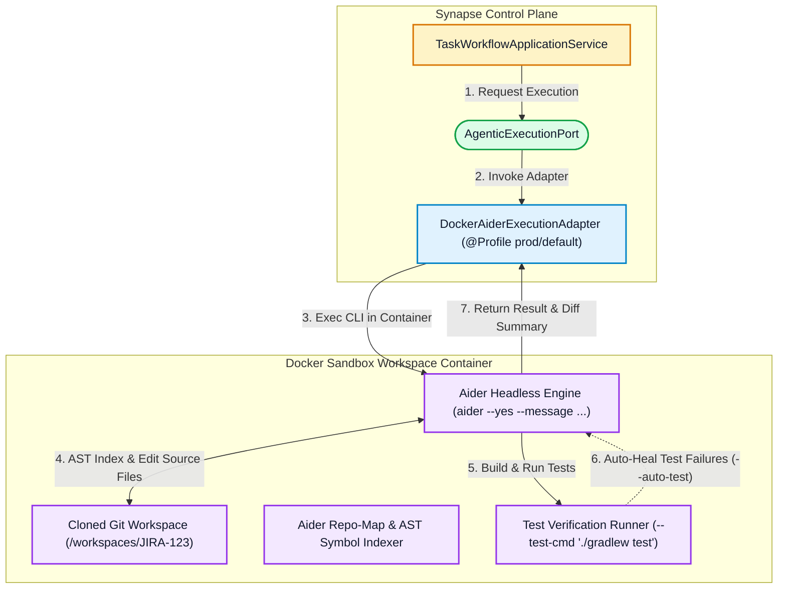
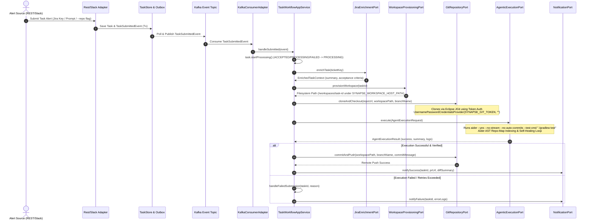

# Synapse Deep Architectural & Technical Reference

> **syn·apse** (/ˈsɪnæps/) *noun*: In a biological system, a synapse is the junction where a signal is transmitted from one nerve cell to another.  
> *In this project: the critical junction where a conversation or alert sparks an autonomous, verifiable action in the codebase.*

---

## 1. System Overview

**Synapse** is an autonomous engineering platform designed to bridge external developer alerts (Slack, REST APIs, Terminals, Jira) with self-driving software development. When a development task is triggered, Synapse ingests the request, reliably decouples processing via an Outbox & Kafka pipeline, enriches context from Jira, provisions an isolated workspace directory, clones the target Git repository using token authentication, executes autonomous code improvements via a headless AI coding engine (**Aider**), and pushes verified commits with interactive user notifications.

---

## 2. Current Architecture (As-Is Implemented Pipeline)

Synapse implements a strict **Hexagonal Architecture (Ports & Adapters)** combined with the **Transactional Outbox Pattern** and **Event-Driven Kafka Messaging**. Today, the As-Is pipeline covers full ingestion, reliable outbox event dispatch, resilient domain task orchestration, Jira ticket enrichment, local/Docker filesystem workspace provisioning, and secure Git cloning via Eclipse JGit token authentication.

### Thorough Breakdown of Implemented As-Is Components:

#### 1. Inbound REST & Slack Ingestion (`SubmitTaskUseCase`)
- **`SlackSignatureVerificationFilter`**: Once-per-request filter enforcing HMAC-SHA256 signature verification (`X-Slack-Signature`) against `synapse.slack.signing-secret` (`SYNAPSE_SLACK_SIGNING_SECRET`) across `/api/slack/*`.
- **`ApiTaskRestAdapter` & `SlackTaskRestAdapter`**: Inbound REST controllers converting external payloads into immutable `SubmitTaskCommand` objects. `SlackTaskRestAdapter` handles `url_verification` handshakes, `app_mention` events, `/synapse` slash commands, and legacy endpoints. To prevent duplicate task submissions from retried deliveries during network latency, `SlackTaskRestAdapter` checks the `X-Slack-Retry-Num` header and immediately acknowledges retries (`200 OK`). *(For full Slack dashboard setup and workspace installation instructions, see [Slack Setup & Installation Guide](SLACK_SETUP.md)).*
- **`SlackPayloadTranslator` & Event Deduplication**: Intelligent event translator supporting `app_mention` and `message` events. When both `app_mentions:read` and `message.channels` are enabled in Slack, a single channel mention fires both events. `SlackPayloadTranslator` deduplicates this by processing `app_mention` and automatically ignoring `message` events in regular channels/groups (`channel_type != "im"`), while fully supporting direct message (`D...` / `im`) task submissions.
- **`SubmitTaskUseCaseHandler`**: Inside an atomic `@Transactional` boundary (`submit()`), it generates a correlation ID, persists the initial `ACCEPTED` task to MongoDB (`SaveTaskPort`), and writes an `UNPUBLISHED` `TaskSubmittedEvent` to the transactional outbox (`SaveDomainEventPort`).

#### 2. Outbox Scheduler & Kafka Publishing
- **`PendingEventPublishJob`**: Regularly polls (`@Scheduled`) for `UNPUBLISHED` outbox events (`LoadDomainEventPort`) and dispatches them via `KafkaDomainEventPublisherAdapter`. Upon Kafka broker ACK or failure, event status (`markAsPublished`) or retry count (`incrementRetryCount`) is updated (`UpdateDomainEventPort`).

#### 3. Consumer Event Routing & Resilient Task State Machine (`TaskWorkflowApplicationService`)
- **`KafkaDomainEventConsumerAdapter` & `HandleDomainEventUseCase`**: Consumes `TaskSubmittedEvent` records and invokes the inbound port `HandleDomainEventUseCase`, which is implemented by `DomainEventProcessorRegistry` to route and dispatch events to `TaskWorkflowApplicationService.handleSubmitted(event)`.
- **Domain State Machine (`Task.java`)**:
  - Enforces explicit lifecycle transitions (`ACCEPTED -> PROCESSING -> COMPLETED / FAILED`).
  - **Idempotent Retries & Recovery**: To support Kafka consumer retries and re-delivered messages without illegal state errors, `Task.startProcessing()` allows transitions from `ACCEPTED`, `PROCESSING` (idempotent retry), and `FAILED` (restarting a previously failed task), while rejecting transitions from terminal `COMPLETED` state.

#### 4. Jira Enrichment Port (`JiraEnrichmentPort` & `JiraRestAdapter`)
- Fetches ticket metadata, title, and acceptance criteria from Jira APIs (`synapse.jira.*`) to formulate structured prompts for downstream agent execution.

#### 5. Workspace Directory & Volume Provisioning (`WorkspaceProvisioningPort`)
- **Strict Single Responsibility**: Dedicated purely to preparing clean filesystem paths and container mount volumes, without network Git operations.
- **Configurable Host Path (`WorkspaceProperties`)**: Uses `synapse.workspace.host-path` (configurable via environment variable `SYNAPSE_WORKSPACE_HOST_PATH`, defaulting to the system temp folder `java.io.tmpdir`).
- **Profile Separation**:
  - **`LocalGitWorkspaceProvisioningAdapter` (`@Profile({"local", "test"})`)**: Creates fast temporary filesystem directories under `SYNAPSE_WORKSPACE_HOST_PATH`.
  - **`DockerWorkspaceProvisioningAdapter` (`@Profile("prod")`)**: Prepares directories under `SYNAPSE_WORKSPACE_HOST_PATH` and configures host volume mappings for isolated Docker sandbox execution.

#### 6. Git Lifecycle, Pre-Flight Handshake & Token Authentication (`GitRepositoryPort`, `JGitRepositoryAdapter`, `CreatePullRequestPort`)
- **Pre-flight Repository Handshake (`validateRepositoryExists`)**: Before provisioning workspace directories or spawning Docker sandboxes, `TaskWorkflowApplicationService` invokes `GitRepositoryPort.validateRepositoryExists(repoUrl)`. Implemented via JGit `lsRemoteRepository()`, this performs a fast remote reference check over HTTPS to verify repository existence, URL correctness, and token access rights, aborting cleanly early if invalid (`handleFailedSubmission`).
- **Eclipse JGit Adapter (`JGitRepositoryAdapter`)**: Clones remote Git repositories into the provisioned workspace directory and creates a feature branch (`feat/<taskId>`).
- **Dynamic Pull Request Target Branch Resolution (`GitHubRestPullRequestAdapter`)**: Implements `CreatePullRequestPort` using Spring `RestClient`. Rather than hardcoding `base: "main"`, `resolveBaseBranch()` dynamically queries `GET /repos/{owner}/{repo}` to detect the target repository's true default branch (`main`, `master`, `develop`), eliminating GitHub `422 Unprocessable Content (base: invalid)` errors during PR creation.
- **Organization Personal Access Token (PAT) & SSO Authentication**: Configured via `synapse.git.token` (`SYNAPSE_GIT_TOKEN`). Supports both Classic PATs (with SAML SSO authorization enabled for private Organization repositories) and Fine-grained PATs (`Contents: Read/Write`, `Pull Requests: Read/Write`). Attaches `UsernamePasswordCredentialsProvider(token, "")` for JGit cloning/pushing and `Bearer <token>` for REST API PR creation without requiring a GitHub username parameter.

#### 7. Slack Notification Dispatch Port (`SendNotificationPort` & `SlackWebhookNotificationAdapter`)
- **`SendNotificationPort`**: Outbound port providing `sendNotification(NotificationRequest request)` (`dev.synapse.domain.notification.SendNotificationPort`) to notify developers and channels of task lifecycle outcomes.
- **`SlackWebhookNotificationAdapter`**: Uses Spring `RestClient` (`@Qualifier("slackRestClient")`) with Block Kit formatting to dispatch real-time Slack notifications on successful pull request creation (`notifySuccess` with PR URL and commit diff) or diagnostic task failures (`notifyFailure` with error logs).

#### 8. Kafka Error Handling & Recovery (`TaskEventConsumerRecordRecoverer`)
- **Retry Logic**: Configured with Spring Kafka `DefaultErrorHandler`. If an exception occurs during task processing, Kafka retries with exponential backoff.
- **Dead-Letter / Terminal Failure Handling**: When retry attempts are exhausted, `TaskEventConsumerRecordRecoverer` invokes `TaskWorkflowApplicationService.handleFailedSubmission(taskId, reason)`, which transitions the task status to `FAILED`.
- **MongoDB Object Versioning (`@Version Long version`)**: `TaskDocument` uses object wrapper `Long version` so Spring Data MongoDB correctly distinguishes new insertions (`version == null` $\rightarrow$ `insertOne`) from updates (`replaceOne`), preventing `E11000 duplicate key errors` during failure state updates.

#### 9. Distributed Tracing & Correlation ID Standardization (`OpenTelemetry` & `CorrelationIdRecordInterceptor`)
- **Standardized Key**: Uses `correlationId` consistently across Spring Boot 4 Micrometer Tracing (`management.tracing.baggage.correlation.fields`), Kafka record headers (`KafkaHeaderNames.CORRELATION_ID`), and `logback.xml` (`%X{correlationId}`).
- **Producer W3C Baggage (`Tracer.createBaggageInScope`)**: When `PendingEventPublishJob` dispatches outbox events, it wraps publication inside `tracer.createBaggageInScope(TracingContext.CORRELATION_ID_KEY, s.correlationId())`, allowing `micrometer-tracing-bridge-otel` to automatically format and transmit W3C `traceparent` and `baggage: correlationId=...` headers across Kafka (`observation-enabled=true`).
- **Consumer Anti-Corruption Layer (`CorrelationIdRecordInterceptor`)**: Encapsulated in its own dedicated component inside `dev.synapse.adapter.in.messaging.interceptor`. Before any `@KafkaListener` executes or when `TaskEventConsumerRecordRecoverer` handles DLQ recovery, `CorrelationIdRecordInterceptor.extractAndSet(record)` guarantees that `correlationId` is extracted from W3C baggage or direct Kafka headers and bound to `TracingContext` (`MDC`), preventing missing correlation IDs across rolling restarts, retries, or heterogeneous producers.
---

## 3. Implemented Notification Pipeline (`SendNotificationPort`)

With workspace provisioning, Jira enrichment, Git cloning/pushing, Aider execution, and PR creation implemented, the final stage of the Synapse pipeline is Slack notification dispatch (`SendNotificationPort`).

1. **Notification Dispatch (`SendNotificationPort` / `SlackWebhookNotificationAdapter`)**: Uses Spring `RestClient` (`@Qualifier("slackRestClient")`) to dispatch Block Kit structured Slack messages when a task succeeds (`notifySuccess` with PR link (`prUrl`) and commit diff summary) or fails (`notifyFailure` with diagnostic error logs).

---
---

## 4. Headless Aider Execution Engine Architecture

Synapse integrates **[Aider](https://aider.chat/)** (`aider-chat`) as its headless open-source coding engine behind `AgenticExecutionPort`.

### Aider Headless Execution Specification
`AiderHeadlessExecutionAdapter` executes Aider non-interactively using the following execution contract:
- **`--message "<ENRICHED_JIRA_PROMPT>"`**: Provides structured instructions formatted from Jira ticket summary and acceptance criteria.
- **`--yes`**: Runs non-interactively without stdin prompts.
- **`--no-stream`**: Disables token streaming for structured output log capture.
- **`--test-cmd "<TEST_COMMAND>"`**: Executes the project's verification suite (`./gradlew test`, `npm test`). If a test fails, Aider automatically feeds the compiler/test error output back into its reasoning loop to self-heal up to `--auto-test` iterations.
- **`--lint-cmd "<LINT_COMMAND>"`**: Automatically lints and corrects syntax immediately after editing.
- **`--no-auto-commits`**: Synapse retains Control Plane ownership of Git commits via `GitRepositoryPort` to ensure clean conventional commits and signed commits post-verification.

### AST Repo-Map Navigation inside Synapse Workspaces
1. **Pre-Cloned Workspace**: Because Aider operates inside a local directory and does not clone remote Git repositories, Synapse pre-provisions `/workspaces/JIRA-123` via `WorkspaceProvisioningPort` and clones the repository via `GitRepositoryPort` (using token authentication `SYNAPSE_GIT_TOKEN`) prior to agent execution.
2. **Repo-Map Discovery**: Inside `/workspaces/JIRA-123`, Aider uses `git ls-files` and tree-sitter AST parsing to build a repository symbol map, scoring symbols against the Jira prompt to select relevant files without exceeding LLM context window limits.

### Multi-Repository DAG Task Orchestration
When a task spans multiple microservice repositories (e.g., API schemas, backend service, frontend UI), Synapse decomposes execution into a **Directed Acyclic Graph (DAG)**:
1. Provisions sibling directories (`/workspaces/PAY-1042/api-contract`, `/workspaces/PAY-1042/backend-service`).
2. Invokes Aider sequentially or in parallel based on topological dependencies.
3. Verifies each repository independently with its own `--test-cmd`.
4. Commits and pushes all affected repository branches atomically once all DAG nodes pass.

---

## 5. End-to-End Sequence Diagram

---

## 6. Architectural Decision Records (ADRs) & Trade-offs

### ADR-1: Isolation & Strategic Execution Environment for Agentic Code Modification
- **Context**: Autonomous AI coding agents execute arbitrary shell scripts, compiler commands, and test suites (`./gradlew test`). We must determine where and how these agents execute relative to the Synapse application server.
- **Decision Options**:
  1. *Host-Based CLI Subprocess Execution*: Run `aider` directly on the host machine where Synapse runs. **Strictly Rejected** due to arbitrary code execution risks, filesystem pollution, missing toolchain isolation, and dependency collisions.
  2. *Standardized Non-Root Docker Sandbox Containers (`DockerWorkspaceProvisioningAdapter`)*: **Selected for Current Implementation**. Production execution runs inside ephemeral, non-root Docker sandboxes (`synapse-sandbox:java25`) with explicit CPU/memory quotas, UID 1000 isolation, and mounted dependency build caches.
  3. *Kubernetes Job / Remote Cloud Sandbox (`KubernetesJobExecutionAdapter`)*: **Strategic Future Architecture**. Because `WorkspaceProvisioningPort` and `AgenticExecutionPort` are pure Hexagonal interfaces, future deployments to Kubernetes clusters can swap in a Kubernetes Job adapter to spawn ephemeral worker pods on demand without modifying core domain orchestration code.

### ADR-2: Asynchronous State Management vs. Synchronous Blocking
- **Decision**: Decouple request ingestion from execution using the **Transactional Outbox Pattern** and **Kafka Event Publishing**. Tasks transition explicitly across persisted domain states (`ACCEPTED -> PROCESSING -> COMPLETED / FAILED`).

### ADR-3: Delegating Coding Loops to Headless Aider (`aider-chat`)
- **Decision**: Avoid building bespoke ReAct AST coding engines inside Java. Synapse acts as the enterprise **Control Plane & Workflow Orchestrator** (ingestion, Jira enrichment, workspace provisioning, Git lifecycle, Slack notifications), while delegating code editing, AST Repo-Map indexing, and `--test-cmd` self-healing loops to **Aider** inside the container sandbox.

### ADR-4: Decoupling Filesystem Provisioning (`WorkspaceProvisioningPort`) from Git Network Lifecycle (`GitRepositoryPort`) & Token-Only Authentication
- **Context**: Combining filesystem directory creation, volume mounts, and network Git cloning inside a single adapter violates the Single Responsibility Principle and complicates auth rotation.
- **Decision**: 
  - **`WorkspaceProvisioningPort`**: Strictly manages local directory paths under `SYNAPSE_WORKSPACE_HOST_PATH` and Docker volume mounts.
  - **`GitRepositoryPort` (`JGitRepositoryAdapter`)**: Handles all network Git repository cloning and feature branch checkout (`feat/<taskId>`).
  - **Token-Only Authentication**: Configured via `synapse.git.token` (`SYNAPSE_GIT_TOKEN`). Does not use a GitHub username parameter. Authenticates against private GitHub Organization repositories over HTTPS via `UsernamePasswordCredentialsProvider(token, "")`.

### ADR-5: Domain State Machine Resilience & Kafka Error Recovery
- **Context**: Asynchronous Kafka retries or redelivered events must not crash with duplicate key errors or illegal state exceptions.
- **Decision**:
  - **MongoDB Object Versioning**: `TaskDocument` uses `@Version Long version` so Spring Data MongoDB cleanly distinguishes new insertions (`insertOne`) from updates (`replaceOne`), avoiding `E11000 DuplicateKeyException` when saving state transitions.
  - **Idempotent State Transitions**: `Task.startProcessing()` allows transitions from `ACCEPTED`, `PROCESSING` (idempotent retry), and `FAILED` (restarting failed tasks), strictly protecting only terminal `COMPLETED` tasks.
  - **Kafka Dead-Letter Handling**: Configured with Spring Kafka `DefaultErrorHandler` and `TaskEventConsumerRecordRecoverer`. Exhausted retries automatically invoke `TaskWorkflowApplicationService.handleFailedSubmission()`, transitioning tasks to `FAILED`.

### ADR-6: Distributed Tracing & Correlation ID Standardization (`correlationId`)
- **Context**: Asynchronous task execution spans inbound HTTP/Slack webhooks, MongoDB persistence, Kafka KRaft brokers, Spring `@Scheduled` outbox jobs, and Docker Aider sandboxes. We must ensure unbroken log traceability and correlation without polluting core domain models or configuration classes with manual `MDC` try-catch blocks.
- **Decision**:
  - **Single Standard Key (`correlationId`)**: Standardized across OpenTelemetry W3C baggage (`application.yml`), Kafka headers (`KafkaHeaderNames.CORRELATION_ID`), and `logback.xml` (`%X{correlationId}`).
  - **Dual Producer/Consumer Safety Net**:
    1. *Producer (`Tracer.createBaggageInScope`)*: `PendingEventPublishJob` natively creates W3C `baggage` envelopes before `KafkaTemplate.send()`.
    2. *Consumer (`CorrelationIdRecordInterceptor` ACL)*: Decoupled into a dedicated Spring component (`dev.synapse.adapter.in.messaging.interceptor`). It intercepts all `ConsumerRecord`s entering `manuelAcknowledgeContainerFactory` and `DefaultErrorHandler`, extracting `correlationId` from either W3C baggage or direct Kafka headers before `@KafkaListener` execution. This guarantees correlation continuity even after application restarts or when consuming records from heterogeneous external producers.

### ADR-7: Outbound Port Naming Standardization (`[Verb][DomainEntity]Port`) & Interface Segregation
- **Context**: As our persistence layer evolved across `Task` and `DomainEvent` (`StoredEvent`), early iterations introduced asymmetric naming (`SaveTaskPort`, `LoadTaskPort` vs. `DomainEventStorePort` or `OutboxEventStorePort`). Additionally, `DomainEventStorePort` combined use case saving (`save()`) with background outbox scheduler polling and retry management (`findByStatus()`, `markAsPublished()`, `incrementRetryCount()`).
- **Decision**:
  - **Ubiquitous Naming Strategy (`[Verb][DomainEntity]Port`)**: Standardized every single persistence outbound port to strictly follow `[Verb][DomainEntity]Port`, ensuring complete symmetry across domain entities:
    - `Task` Ports: `SaveTaskPort`, `LoadTaskPort`
    - `DomainEvent` Ports: `SaveDomainEventPort`, `LoadDomainEventPort`, `UpdateDomainEventPort`
  - **Interface Segregation Principle (ISP)**:
  - **Composite Adapter (`MongoEventStoreAdapter`)**: Implements `SaveDomainEventPort, LoadDomainEventPort, UpdateDomainEventPort`, keeping MongoDB persistence encapsulated behind segregated Hexagonal interfaces.

### ADR-8: Pre-Flight Repository Handshake (`validateRepositoryExists`) & Dynamic PR Base Branch Discovery
- **Context**: When tasks are submitted with invalid repository URLs, expired tokens, or targeting repositories whose default branch is `master` or `develop` instead of `main`, failures previously happened deep inside the Docker execution phase or when calling GitHub's `POST /pulls` API (`422 Unprocessable Content`). This wasted compute resources on sandbox provisioning and produced opaque errors.
- **Decision**:
  - **Pre-flight Remote Reference Handshake**: Added `GitRepositoryPort.validateRepositoryExists(repoUrl)` right before workspace provisioning in `TaskWorkflowApplicationService`. Using JGit `lsRemoteRepository()`, Synapse performs a lightweight HTTPS handshake to verify repository existence and token read permissions early, failing fast (`handleFailedSubmission`) if invalid.
  - **Dynamic Base Branch Discovery**: Updated `GitHubRestPullRequestAdapter.resolveBaseBranch()` to query `GET /repos/{owner}/{repo}` when `synapse.git.default-base-branch` is `"main"` or unset. By discovering the repository's exact `default_branch` at runtime, we eliminate `422 Unprocessable Content (base: invalid)` errors across multi-repository environments.

### ADR-9: Slack Ingestion Deduplication (`app_mention` vs `message`) & Webhook Retry Protection (`X-Slack-Retry-Num`)
- **Context**: When Synapse's Slack App subscribes to both `app_mentions:read` (`app_mention`) and `message.channels` (`message`), mentioning `@Synapse` in a public channel triggers two simultaneous webhook deliveries from Slack. Furthermore, if network latency or Kafka outbox processing exceeds 3 seconds, Slack retries delivery up to 3 times (`X-Slack-Retry-Num`), leading to duplicate `SubmitTaskCommand` executions.
- **Decision**:
  - **Inbound Event Deduplication (`SlackPayloadTranslator`)**: Separated event translation rules so that `app_mention` is exclusively responsible for handling explicit `@mentions` in channels (`C...`/`G...`). Accompanying `message` events in channels are ignored (`Optional.empty()`), while `message` events in Direct Messages (`D...` / `im`) are processed directly.
  - **HTTP Header Retry Interception (`SlackTaskRestAdapter`)**: Added `@RequestHeader(value = "X-Slack-Retry-Num", required = false)` checking in `handleEvents()`. Any request containing this header is logged and immediately acknowledged (`200 OK`) without invoking `SubmitTaskUseCase`.
