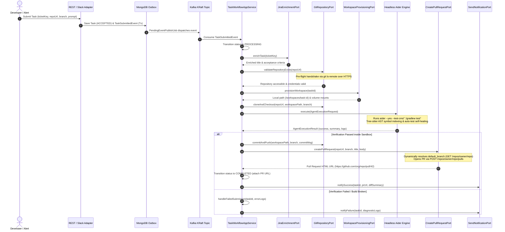
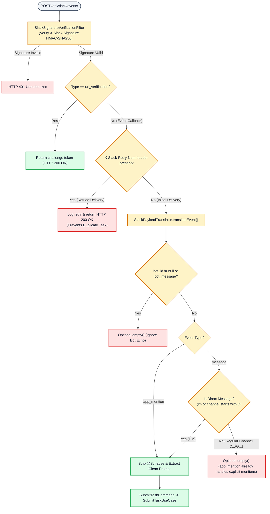
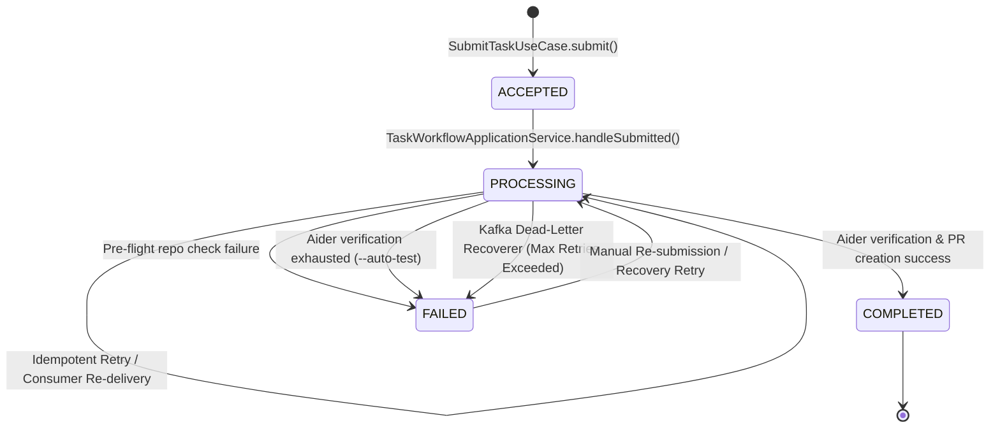

# Synapse Operational & Developer Workflows

This document serves as the canonical reference for all core operational, ingestion, execution, and recovery workflows across the **Synapse Autonomous AI Engineering Platform**.

---

## 1. End-to-End Autonomous Task Execution Workflow

When a task is submitted via REST or Slack, Synapse orchestrates an asynchronous, verifiable development lifecycle inside an isolated container sandbox before publishing code to GitHub.



---

## 2. Slack Ingestion, Event Deduplication & Retry Protection Workflow

To ensure reliable alert ingestion without duplicate coding tasks, `SlackTaskRestAdapter` and `SlackPayloadTranslator` enforce strict filtering rules at the edge.



### Key Rules:
1. **HMAC Signature Verification**: Every Slack request must pass `SlackSignatureVerificationFilter` validation against `SYNAPSE_SLACK_SIGNING_SECRET`.
2. **Webhook Retry Filtering**: If network latency or Kafka processing exceeds Slack's 3-second timeout, Slack retries delivery (`X-Slack-Retry-Num`). Synapse acknowledges `200 OK` instantly to drop duplicates.
3. **Channel Mention vs. Direct Message Deduplication**: In public or private channels, explicit `@Synapse` tags trigger both `app_mention` and `message` events simultaneously. Synapse processes `app_mention` and drops the redundant `message` event. In Direct Messages (`im`), `message` events are processed cleanly.

---

## 3. Pre-Flight Repository Handshake & Dynamic Pull Request Workflow

Before spawning heavy Docker containers or executing AI reasoning loops, Synapse validates repository availability and target branch metadata.

### Pre-Flight Remote Reference Check (`validateRepositoryExists`)
1. **Trigger**: Immediately upon receiving a `TaskSubmittedEvent` inside `TaskWorkflowApplicationService.handleSubmitted()`.
2. **Action**: `GitRepositoryPort.validateRepositoryExists(repositoryUrl)` invokes JGit's `lsRemoteRepository()`, establishing a quick HTTPS handshake using `SYNAPSE_GIT_TOKEN`.
3. **Outcome**:
   - **Accessible**: Handshake returns remote references (`refs/heads/*`), allowing workspace provisioning to proceed.
   - **Inaccessible / Authentication Failure**: Handshake throws an exception (`RemoteRepositoryException` / `TransportException`). Synapse aborts execution immediately, transitions the task to `FAILED`, and sends a diagnostic Slack alert without spinning up Docker sandboxes.

### Dynamic Pull Request Target Resolution (`resolveBaseBranch`)
When `CreatePullRequestPort.createPullRequest(repoUrl, headBranch, title, body)` is called:
1. If `synapse.git.default-base-branch` is explicitly configured to a non-default branch (e.g., `develop` or `release/v2`), that branch is targeted directly.
2. If configured to `"main"` or left blank, `GitHubRestPullRequestAdapter.resolveBaseBranch()` sends a lightweight `GET https://api.github.com/repos/{owner}/{repo}` request authenticated with `Bearer SYNAPSE_GIT_TOKEN`.
3. The response `default_branch` (`main`, `master`, `trunk`, or `develop`) is extracted and passed directly to `POST /repos/{owner}/{repo}/pulls`, guaranteeing that pull requests open without `422 Unprocessable Content (base: invalid)` errors.

---

## 4. Resilient Failure Recovery & Dead-Letter Queue (DLQ) Workflow

Synapse protects internal state consistency across transient network glitches and terminal agent failures using Spring Kafka and MongoDB versioning.



### Recovery Mechanisms:
* **Kafka Exponential Backoff**: `DefaultErrorHandler` retries transient consumer failures (e.g., temporary database lock or network timeout) with exponential backoff.
* **Dead-Letter Recoverer (`TaskEventConsumerRecordRecoverer`)**: When maximum retry attempts are exhausted, `TaskEventConsumerRecordRecoverer` catches the record and invokes `TaskWorkflowApplicationService.handleFailedSubmission(taskId, reason)`.
* **MongoDB Version-Safe Updates**: `TaskDocument` enforces optimistic locking via `@Version Long version`. This ensures that state updates (`ACCEPTED -> FAILED` or `PROCESSING -> COMPLETED`) cleanly execute as `replaceOne` rather than generating `E11000 duplicate key` exceptions during concurrent retries.

---

## 5. Local Development & Offline TDD Workflow

Engineers working on Synapse can develop, test, and verify code locally without requiring external backing services or active GitHub connections.

### Step 1: Run Offline Unit & Integration Tests
Synapse's test suite uses `@Profile("test")` and `LocalGitWorkspaceProvisioningAdapter` to execute entirely on the local filesystem:
```bash
./gradlew test jacocoTestReport
```
View the generated JaCoCo coverage report at `build/reports/jacoco/test/html/index.html` (minimum 80% coverage required across domain state machines and adapters).

### Step 2: Build the AI Sandbox Image
When testing agentic container execution (`@Profile("prod")`), pre-build the headless Aider Docker image:
```bash
docker build -t synapse-sandbox:java25 -f Dockerfile.sandbox .
```

### Step 3: Run with Local Backing Services
Launch local MongoDB (`:27017`) and Kafka KRaft (`:29092`) via Docker Compose, then start Synapse:
```bash
# Start local MongoDB & Kafka
docker compose up -d

# Run Synapse application server
./gradlew bootRun
```
